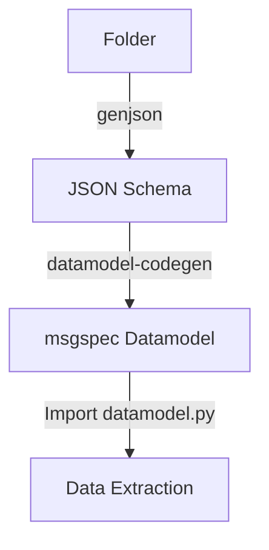

# Overview
BTAutoJSON parses JSON files and automatically creates a schema from them with a union of all possible fields. Afterwards, a datamodel in a variety of serialization/deserialization libraries can be created. This enables data extraction with a nested class representing the format, and can be imported in python. The parsed data can also be used by a python dataframe and exported to a preferred format, I.E. `.csv`, `.xlsx`, `pandas`, etc.

## Requirements
* Python 3
* Environment with genjson, pandas, numpy, matplotlib, msgspec

## General Use

## Notes
* Code was hastily cobbled together. Needs cleanup.
* Versioning and dynamic importing could be used to consume the datamodels in a separate script. 

